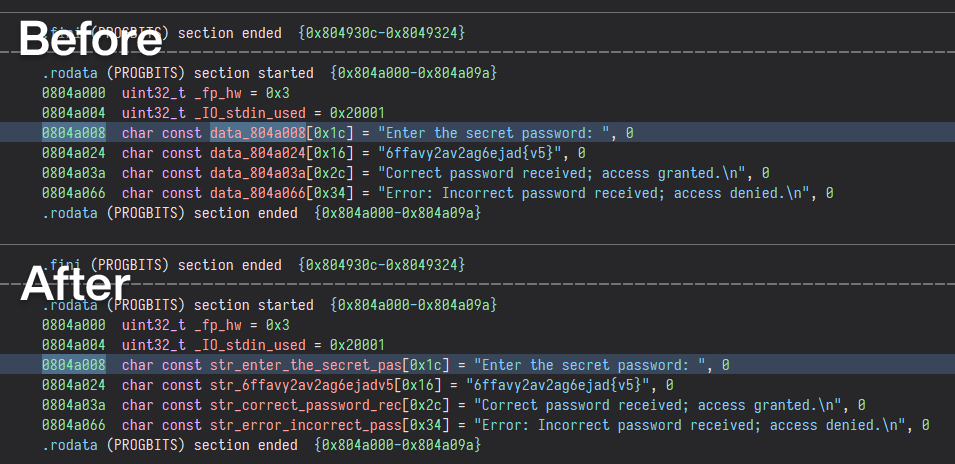

# String Utilities

This is a tiny plugin I wrote to start learning the Binary Ninja API.

**Warning: May be unstable on large databases.**

## Features

This plugin is pretty limited in functionality, but can help you automatically
rename single strings or all the recognized strings in a database.

## License

See LICENSE.txt for details.
